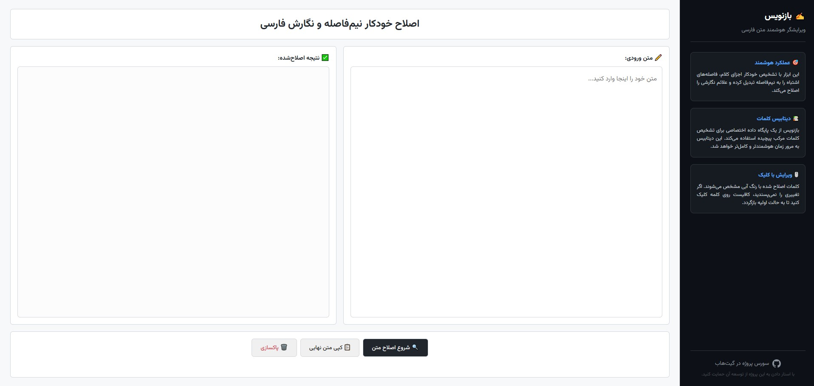

# ✍️ بازنویس (ویرایشگر هوشمند متن فارسی)

  <strong><a href="https://radmehr2025.github.io/Baznevis/">🔗 مشاهده دموی آنلاین پروژه</a></strong>

  <a href="README-en.md">🇺🇸 View English Version</a>

**بازنویس** یک ابزار تحت وب سبک، هوشمند و تعاملی برای اصلاح نگارش فارسی و **نیم‌فاصله (ZWNJ)** است. این پروژه از فونت محبوب [وزیرمتن](https://github.com/rastikerdar/vazirmatn) استفاده می‌کند که برای تضمین قابلیت **استفاده کاملاً آفلاین**، به صورت Base64 مستقیماً درون کد جاسازی شده است.

## 🚀 قابلیت‌ها
- **استفاده آفلاین (Offline Ready):** به دلیل جاسازی فونت و کدها، پس از یکبار دانلود بدون نیاز به اینترنت کار می‌کند.
- **اصلاح هوشمند نیم‌فاصله:** تشخیص و اصلاح خودکار پیشوندها، پسوندها و کلمات مرکب.
- **دیتابیس کلمات مرکب:** لغت‌نامه داخلی برای اصلاح کلمات پیچیده (مانند «نرم‌افزار»).
- **ویرایش تعاملی:** با کلیک روی کلمات اصلاح شده در خروجی، می‌توانید نیم‌فاصله را به فاصله معمولی تبدیل کنید.
- **اصلاح علائم نگارشی و اعداد:** تنظیم فاصله علائم نگارشی و تبدیل خودکار اعداد به فارسی.
- **کاملاً رسپانسیو:** طراحی بهینه برای دسکتاپ، تبلت و موبایل.

## 🛠️ تکنولوژی‌ها
- HTML5, CSS3 (Embedded Vazirmatn Font), Vanilla JavaScript.

## 💻 نصب و راه‌اندازی
این پروژه تنها شامل **یک فایل HTML** است و هیچ وابستگی خارجی ندارد:
- **استفاده لوکال:** فایل را دانلود کرده و `index.html` را در مرورگر باز کنید (حتی بدون اینترنت).
- **بارگذاری روی هاست:** فایل `index.html` را در هر هاست یا سرویس میزبانی ایستا آپلود کنید.

## 📖 راهنمای استفاده
متن خود را وارد کرده، روی دکمه «شروع اصلاح» کلیک کنید، در صورت نیاز با کلیک روی کلمات آن‌ها را ویرایش دستی کنید و در نهایت متن را کپی نمایید.

## 🤝 مشارکت
دیتابیس کلمات مرکب این پروژه به مرور زمان کامل‌تر خواهد شد. برای افزودن کلمات جدید، خوشحال می‌شویم Pull Request ارسال کنید!

## 📄 لایسنس
این پروژه تحت لایسنس MIT منتشر شده است.
